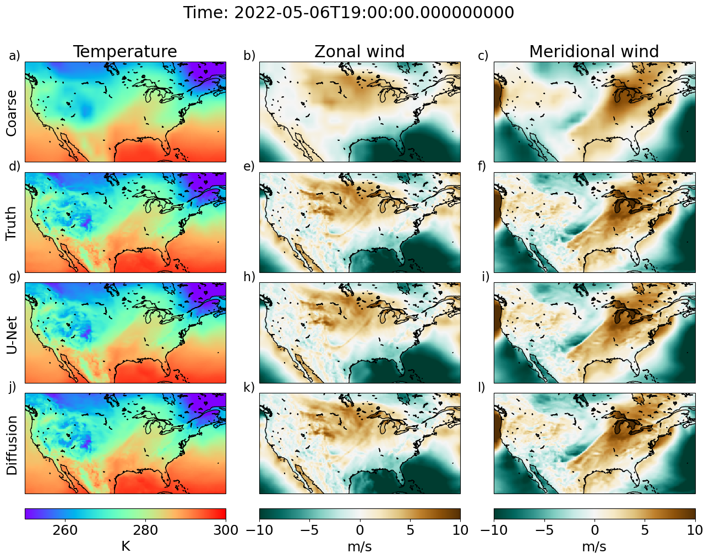

# Generative Diffusion-based Downscaling for Climate

**Authors:** Robbie A. Watt & Laura A. Mansfield  
**Paper:** [arXiv:2404.17752](https://arxiv.org/abs/2404.17752)



This repository implements generative diffusion models and U-Nets for climate data downscaling, specifically for super-resolution of ERA5 temperature data from coarse to fine resolution. The diffusion model is based on the EDM implementation by T. Karras et al. ([arXiv:2206.00364](https://arxiv.org/abs/2206.00364)) and adapted from [NVlabs/edm](https://github.com/NVlabs/edm).

## Overview

This project applies state-of-the-art generative models to climate downscaling problems, comparing diffusion-based approaches against traditional U-Net architectures. The models learn to generate high-resolution temperature fields from low-resolution inputs, conditioned on temporal information (day of year, hour) and static geographical features (land-sea mask, topography).

### Key Features
- **Dual Model Architecture**: Both diffusion (EDMPrecond) and U-Net implementations
- **Climate-Specific Conditioning**: Uses temporal and geographical context
- **Efficient Training**: Weekly data subsampling (86% reduction) for faster training
- **Comprehensive Evaluation**: Multiple error metrics and spectral analysis

## Project Structure

```
├── src/                          # Core training and model code
│   ├── TrainDiffusion.py        # Diffusion model training
│   ├── TrainUnet.py             # U-Net training
│   ├── Network.py               # Model architectures (EDMPrecond, U-Net)
│   ├── DatasetUS.py             # Climate data loading and preprocessing
│   └── Inference.py             # Model inference utilities
├── examples/                     # Training examples and notebooks
│   ├── train_minimal.ipynb      # Quick start example
│   ├── inference.ipynb          # Inference examples
│   └── runs_*/                  # TensorBoard logs
├── data/                        # ERA5 climate data (1953-1957)
│   ├── 1953-1957/              # Monthly temperature files
│   ├── samples_*.nc            # Processed yearly samples
│   └── ERA5_const_sfc_variables.nc  # Static variables
├── data_reduced_*/              # Downsampled data for different resolutions
├── Model_chpt/                  # Trained model checkpoints
└── download_era5_cds.py         # ERA5 data download script
```

## Quick Start

### 1. Environment Setup

```bash
# Install dependencies
conda env create -f environment.yml
conda activate climate-diffusion

# Or install manually
pip install torch tensorboard xarray netcdf4 cartopy matplotlib scipy numpy
```

### 2. Data Preparation

The project includes pre-processed ERA5 data (1953-1957) in the `data/` directory. For custom data:

```bash
# Download ERA5 data (requires CDS API setup)
python download_era5_cds.py

# Preprocess data
python preprocess_era5_data.py
```

### 3. Training

**Minimal Example (2 epochs, CPU-friendly):**
```bash
cd examples/
jupyter notebook train_minimal.ipynb
```

**Full Training:**
```bash
# Train diffusion model
python src/TrainDiffusion.py

# Train U-Net model  
python src/TrainUnet.py
```

### 4. Model Configuration

**Key Training Parameters:**
- **Epochs**: 10,000 (full training) / 2 (minimal example)
- **Batch Size**: 8 (full) / 4 (minimal)
- **Learning Rate**: 1e-4 (diffusion) / 3e-5 (U-Net)
- **Resolution**: 256×128 (longitude×latitude)
- **Data**: Weekly subsampled (86% reduction for speed)

**Model Architecture:**
- **Input Channels**: 4 (1 noisy + 3 conditional: temp + land-sea mask + topography)
- **Output Channels**: 1 (temperature)
- **Conditioning**: Day of year + hour (2D label)
- **Sampling**: 40 denoising steps (diffusion)

## Usage

### Training Scripts

The main training scripts support both diffusion and U-Net approaches:

```python
# Diffusion training (TrainDiffusion.py)
- Model: EDMPrecond with U-Net backbone
- Loss: EDM loss function
- Sampling: Iterative denoising (40 steps)

# U-Net training (TrainUnet.py)  
- Model: Standard U-Net architecture
- Loss: MSE loss
- Sampling: Direct inference
```

### Data Loading

The `UpscaleDataset` class handles climate data loading with:
- Automatic temporal subsampling (weekly)
- Normalization of temperature and static variables
- Support for multiple years and constant variables
- GPU-optimized tensor operations

### Inference

After training, use the inference scripts to generate predictions:

```python
from src.Inference import sample_model

# Generate samples
(fig, ax), (base_error, pred_error) = sample_model(
    model, dataloader, device="cuda"
)
```

## Dependencies

- **Python**: >=3.9
- **PyTorch**: For deep learning
- **Climate Data**: xarray, netcdf4, cartopy
- **Visualization**: matplotlib
- **Utilities**: numpy, scipy, tqdm, tensorboard

## Results

The models are evaluated on:
- **Spatial Error Metrics**: MAE, RMSE across the domain
- **Spectral Analysis**: Power spectrum comparison
- **Visual Quality**: Side-by-side comparison plots

Training typically shows:
- Initial loss: ~0.97 (diffusion) / varies (U-Net)
- Convergence: Loss decreases over 10,000 epochs
- Runtime: ~12.7s per batch (CPU), faster with GPU

## Citation

```bibtex
@misc{watt2024generative,
      title={Generative Diffusion-based Downscaling for Climate}, 
      author={Robbie A. Watt and Laura A. Mansfield},
      year={2024},
      eprint={2404.17752},
      archivePrefix={arXiv},
      primaryClass={physics.ao-ph}
}
```